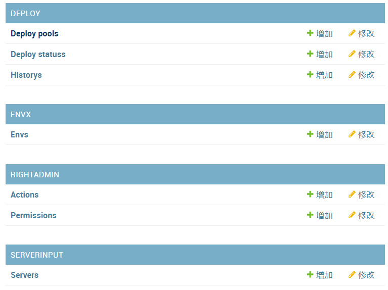

### 基础配置

##### 安装软件

```sh
#服务器配置虚拟环境
mkdir manabe
cd manabe
pip3 install pipenv 
pipenv shell


#安装包
(manabe) root@database:~/devops/manabe# cat requirements.txt 
channels==2.1.4
Django==2.1.3
djangorestframework==3.9.0
gunicorn==19.9.0
PyMySQL==0.9.2
python-jenkins==1.4.0
Twisted==18.9.0
uWSGI==2.0.17.1

pip3 install -r requirements.txt 
```


##### 创建django项目

```sh
D:\github\python-manabe>django-admin startproject manabe

D:\github\python-manabe>cd manabe

D:\github\python-manabe\manabe>python manage.py startapp serverinput

D:\github\python-manabe\manabe>python manage.py startapp appinput

D:\github\python-manabe\manabe>python manage.py startapp deploy

D:\github\python-manabe\manabe>python manage.py startapp envx

D:\github\python-manabe\manabe>python manage.py startapp rightadmin

D:\github\python-manabe\manabe>python manage.py startapp public
```

##### 修改settings.py

```python
#注释
'''
AUTH_PASSWORD_VALIDATORS = [
    {
        'NAME': 'django.contrib.auth.password_validation.UserAttributeSimilarityValidator',
    },
    {
        'NAME': 'django.contrib.auth.password_validation.MinimumLengthValidator',
    },
    {
        'NAME': 'django.contrib.auth.password_validation.CommonPasswordValidator',
    },
    {
        'NAME': 'django.contrib.auth.password_validation.NumericPasswordValidator',
    },
]
'''

# 语言
LANGUAGE_CODE = 'zh-hans'
TIME_ZONE = 'Asia/Shanghai'


ALLOWED_HOSTS = ['*']

# 数据库使用mysql
DATABASES = {
    'default':{
        'ENGINE':'django.db.backends.mysql',

        'NAME':'manabe',

        'USER':'root',

        'PASSWORD':'123',

        'HOST': '192.168.157.49',

        'PORT': '3306',
    }
}

# 注册app,将上面创建的app注册进去，不然数据库下models等代码迁移不生效
INSTALLED_APPS = [
    'rest_framework',
    'rest_framework.authtoken',
    'django.contrib.admin',
    'django.contrib.auth',
    'django.contrib.contenttypes',
    'django.contrib.sessions',
    'django.contrib.messages',
    'django.contrib.staticfiles',
    'public.apps.PublicConfig',
    'appinput.apps.AppinputConfig',
    'deploy.apps.DeployConfig',
    'envx.apps.EnvxConfig',
    'rightadmin.apps.RightadminConfig',
    'serverinput.apps.ServerinputConfig',
    'api.apps.ApiConfig',
]
```

##### 数据库配置

```sql
# 安装数据库省略
create database manabe DEFAULT CHARACTER SET  utf8;
GRANT ALL PRIVILEGES ON *.* TO 'root'@'%' IDENTIFIED BY '1234';
GRANT ALL PRIVILEGES ON *.* TO 'ubuntu'@'%' IDENTIFIED BY '1234';
GRANT ALL PRIVILEGES ON *.* TO 'ubuntu'@'localhost' IDENTIFIED BY '1234';
GRANT ALL PRIVILEGES ON *.* TO 'root'@'localhost' IDENTIFIED BY '1234';
flush privileges;
exit
```

#####  配置pycharm远程提交代码

[PyCharm 配置远程python解释器](https://www.cnblogs.com/sddai/p/9648211.html)


##### 数据库迁移

```sh
# 修改python引擎
(manabe) root@database:~/devops/manabe/manabe# cat  manabe/__init__.py   
import pymysql
pymysql.install_as_MySQLdb()

# 服务器操作
(manabe) root@database:~/devops/manabe/manabe# python manage.py  makemigrations
(manabe) root@database:~/devops/manabe/manabe# python manage.py  migrate

# 创建超级用户
(manabe) root@database:~/devops/manabe/manabe# python manage.py  createsuperuser
用户名 (leave blank to use 'root'): admin

# 测试访问
(manabe) root@database:~/devops/manabe/manabe# python manage.py runserver 0.0.0.0:5000
```

##### url路由调整

```python
#主app-manabe下修改如下
from django.contrib import admin
from django.urls import path,include

urlpatterns = [
    path('admin/', admin.site.urls),
]

urlpatterns += [path('app/',include('appinput.urls')),]
urlpatterns += [path('deploy/',include('deploy.urls')),]
urlpatterns += [path('envx/',include('envx.urls')),]
urlpatterns += [path('public/',include('public.urls')),]
urlpatterns += [path('rightadmin/',include('rightadmin.urls'))]
urlpatterns += [path('server/',include('serverinput.urls'))]


# 每个子app添加urls文件，并写入
from django.urls import path
app_name='appinput'  #对应名称更改
urlpatterns=[]
```


### models

##### 字符编码问题

[修改数据库mysql字符编码为UTF8 - chbxw - 博客园](https://www.cnblogs.com/chengbao/p/4858709.html)

```sh
步骤2：修改my.cnf配置文件，修改后如下（/etc/my.cnf）：

[client]

#password      = your_password

port           = 3306

socket         = /var/lib/mysql/mysql.sock

default-character-set=utf8     #设置默认编码为UTF8


# sql
show create table deploy_deploystatus;
ALTER DATABASE manabe　DEFAULT    CHARACTER SET utf8  COLLATE utf8_general_ci;
ALTER TABLE `deploy_deploystatus`  DEFAULT   CHARACTER   SET   utf8  COLLATE  utf8_general_ci;
ALTER TABLE deploy_deploystatus CHANGE description description VARCHAR(100) CHARACTER SET utf8 COLLATE utf8_general_ci;

```


##### public models.py

###### 公共字段表

```python
from django.db import models

# 公共字段表
# Create your models here.
class CommonInfo(models.Model):
    name=models.CharField(max_length=100,unique=True,verbose_name="名称")
    description=models.CharField(max_length=100,blank=True,null=True,verbose_name="描述")
    change_date=models.DateTimeField(auto_now=True)     #改变时，更改时间
    add_date=models.DateTimeField(auto_now_add=True)   #添加时间
    status=models.BooleanField(default=True)

    def __str__(self):
        return self.name

    class Meta:
        abstract=True   #定义为抽象表
        ordering=('-change_date0',)
```

##### appinput models.py

###### 应用数据表

```python
from django.db import models
from django.contrib.auth.models import User  #使用django自带的用户model
from public.models import CommonInfo

from django.db.models.signals import post_save
from django.dispatch import receiver
from rest_framework.authtoken.models import Token
from django.conf import settings

# 应用数据表
# 每当创建新用户并将其保存到数据库时，就会触发此代码
@receiver(post_save,sender=settings.AUTH_USER_MODEL)
def create_auth_token(sender,instance=None,created=False,**kwargs):
    if created:
        Token.objects.create(user=instance)

class App(CommonInfo):
    """
    应用
    """
    jenkins_job=models.CharField(max_length=255,verbose_name="JENKINS JOB名称")
    git_url=models.CharField(max_length=512,verbose_name="Git地址")
    dir_build_file=models.CharField(max_length=512,verbose_name="编译目录")
    build_cmd=models.CharField(max_length=512,default="./",verbose_name="编译命令")
    is_restart_status=models.BooleanField(default=True,verbose_name="是否重启")
    package_name=models.CharField(max_length=128,blank=True,null=True,verbose_name="软件包名")
    zip_package_name=models.CharField(max_length=128,blank=True,null=True,verbose_name="压缩包名")
    op_log_no=models.IntegerField(blank=True,null=True,default=0)  #记录服务启动停止操作次数
    manage_user=models.ForeignKey(User,blank=True,null=True,related_name="manager_user",on_delete=models.CASCADE,verbose_name="APP管理员") #models.CASCADE：删除主表数据，从表数据也会删除
    script_url=models.CharField(max_length=128,blank=True,null=True,verbose_name="app脚本链接")


    def __str__(self):
        return self.name

    class Meta:
        db_table= 'App'
        ordering=('-add_date',)
```


##### envx models.py 

###### 环境数据表

```python
from django.db import models
from public.models import CommonInfo

# Create your models here.
class Env(CommonInfo):
    eid=models.IntegerField(unique=True,verbose_name="环境序号")

    
    
    
# 迁移
python manage.py makemigrations envx  #只扫描envx的app
python manage.py migrate envx  #只迁移envx的app
```

##### serverinput models.py

###### 服务器表

```python
from django.db import models
from django.contrib.auth.models import User
from appinput.models import App
from envx.models import Env
from public.models import CommonInfo

# Create your models here.

class Server(CommonInfo):
    """
    服务器
    """
    # 服务器ip地址
    ip_address=models.CharField(max_length=24,verbose_name="IP地址")
    
    # salt agent名称
    salt_name=models.CharField(max_length=128,verbose_name="SaltStack minion")
    
    # 服务器上app对应的端口号
    port=models.CharField(max_length=100,verbose_name="端口")

    # 服务器对应的所有app应用
    app_name=models.ForeignKey(App,related_name='app_name',on_delete=models.CASCADE,verbose_name="应用名")

    env_name=models.ForeignKey(Env,blank=True,null=True,related_name="server_env_name",on_delete=models.CASCADE,verbose_name="环境")

    # 服务启动用户，root或者其他
    app_user=models.CharField(max_length=24,blank=True,null=True,verbose_name="执行程序用户")

    # 谁进行了app操作
    op_user=models.ForeignKey(User,blank=True,null=True,verbose_name="操作用户")

    # 服务器已部署多少个发布单，回滚时需要
    history_deploy=models.CharField(max_length=512,blank=True,null=True,verbose_name="已部署版本")

    deploy_status=models.CharField(max_length=128,null=True,blank=True,verbose_name="发布状态(Err,Suc)")

```


##### deploy models.py

###### 发布状态数据表

```python
from django.db import models
from public.models import CommonInfo
# Create your models here.
class DeployStatus(CommonInfo):
    # 新建，编译，待发布，成功，失败，发布中
    memo=models.CharField(max_length=1024,blank=True,verbose_name="备注")

```


###### 发布单数据表

```python
from django.db import models
from public.models import CommonInfo
from appinput.models import App
from django.contrib.auth.models import User
from envx.models import Env

# Create your models here.
class DeployStatus(CommonInfo):
    # 新建，编译，待发布，成功，失败，发布中
    memo=models.CharField(max_length=1024,blank=True,verbose_name="备注")


IS_INC_TOT_CHOICES=(('TOT',r'全量部署'),('INT',r'增量部署'))

DEPLOY_TYPE_CHOICES=(('deployall',r'发布所有'),('deploypkg',r'发布程序'),('deploycfg',r'发布配置'),('rollback',r'回滚'),)

class DeployPool(CommonInfo):
    name=models.CharField(max_length=100,verbose_name="发布单编号")
    description = models.CharField(max_length=1024,blank=True,verbose_name="描述")
    app_name=models.ForeignKey(App,related_name='deploy_app',on_delete=models.CASCADE,verbose_name="APP应用")
    deploy_no=models.IntegerField(blank=True,null=True,default=0)
    branch_build=models.CharField(max_length=255,blank=True,null=True)
    jenkins_number=models.CharField(max_length=255,blank=True,null=True)
    code_number=models.CharField(max_length=255,choices=IS_INC_TOT_CHOICES,blank=True,null=True,verbose_name="全量或增量部署")
    is_inc_tot = models.CharField(max_length=255,choices=IS_INC_TOT_CHOICES,blank=True, null=True,verbose_name="全量或增量部署")
    deploy_type = models.CharField(max_length=255,choices=DEPLOY_TYPE_CHOICES,blank=True, null=True,verbose_name="发布程序或配置")
    is_build = models.BooleanField(default=False,verbose_name="软件是否编译成功")
    create_user = models.ForeignKey(User,related_name='deploy_create_user',on_delete=models.CASCADE,verbose_name="创建用户")
    nginx_url = models.URLField(default=None, blank=True, null=True,verbose_name="Tengine URL")
    env_name = models.ForeignKey(Env, blank=True, null=True,related_name="deploy_env_name",on_delete=models.CASCADE,verbose_name="环境")
    deploy_status = models.ForeignKey(DeployStatus,related_name='deploy_pool_status',blank=True, null=True,on_delete=models.CASCADE,verbose_name="发布单状态")
```


###### 发布单历史数据表

```python
# 发布单历史数据表
class History(CommonInfo):
    user = models.ForeignKey(User,  blank=True, null=True,related_name='history_user',on_delete=models.CASCADE,verbose_name="用户")
    app_name = models.ForeignKey(App, blank=True, null=True,related_name='history_app',on_delete=models.CASCADE,verbose_name="APP应用")
    env_name = models.ForeignKey(Env, blank=True, null=True,related_name="history_env_name",on_delete=models.CASCADE,verbose_name="环境")
    deploy_name = models.ForeignKey(DeployPool,blank=True, null=True,related_name="history_deploy",on_delete=models.CASCADE,verbose_name="发布单")
    do_type = models.CharField(max_length=32,blank=True, null=True,verbose_name="操作类型")
    content = models.CharField(max_length=1024,blank=True, null=True,verbose_name="操作内容")
```

##### rightadmin models.py

###### 权限管理数据表

```python
from django.db import models
from public.models import CommonInfo
from django.contrib.auth.models import User
from envx.models import Env
from appinput.models import App
# Create your models here.


class Action(CommonInfo):
    aid = models.IntegerField(unique=True,
                              verbose_name="权限序号")


class Permission(CommonInfo):
    app_name = models.ForeignKey(App,
                                 related_name="pm_app_name",
                                 on_delete=models.CASCADE,
                                 verbose_name="APP应用")
    env_name = models.ForeignKey(Env,
                                 blank=True,
                                 null=True,
                                 related_name="pm_env_name",
                                 on_delete=models.CASCADE,
                                 verbose_name="环境")
    action_name = models.ForeignKey(Action,
                                    related_name="pm_action_name",
                                    on_delete=models.CASCADE,
                                    verbose_name="操作权限")
    main_user = models.ManyToManyField(User,
                                       blank=True,
                                       related_name="pm_user",
                                       verbose_name="操作用户")
```

### 注册到对应admin




```python
# 更改appinput/admin.py 将数据表注册到后台页面
from django.contrib import admin
# Register your models here.
from . import models
admin.site.register(models.App)


python manage.py runserver 0.0.0.0:5000   #启动服务，查看后台，使用创建的超级用户密
```


### 数据库迁移

```python
python manage.py makemigrations
python manage.py migrate     #数据库创建App表
python manage.py  createsuperuser   #用户admin，密码123
```


### 模拟数据

public/management/commands/

```sh
public/
├── management
│   ├── commands
│   │   ├── fake_action.py
│   │   ├── fake_app.py
│   │   ├── fake_data.py   #调用其他py文件中的函数生成模拟数据
│   │   ├── fake_deploy.py
│   │   ├── fake_deploy_status.py
│   │   ├── fake_env.py
│   │   ├── fake_permission.py
│   │   ├── fake_server.py
│   │   ├── fake_user.py
│   │   ├── __init__.py
```

- 生成数据

```sh
python manage.py fake_data
```


```python
# 创建目录和文件
(manabe) root@database:~/devops/manabe/manabe/public# tree management/
management/
├── commands
│   ├── fake_app.py    #修改model-App表数据
│   ├── fake_data.py   #main文件，从此处调用其他文件修改数据
│   ├── fake_user.py   #修改model-user表数据
│   └── __init__.py    #空文件
└── __init__.py    #空文件


# fake_user.py 文件
from django.contrib.auth.models import User,Group   #导入django自带的model（用户表）

def fake_user_data():
    User.objects.all().delete()   #清除所有用户
    Group.objects.all().delete()   #清除所有用户组
    print("delete all user data")
    User.objects.create_user(username='Dylan', password="password")
    User.objects.create_user(username='Tyler', password="password")
    User.objects.create_user(username='Kyle', password="password")
    User.objects.create_user(username='Dakota', password="password")
    User.objects.create_user(username='Marcus', password="password")
    User.objects.create_user(username='Samantha', password="password")
    User.objects.create_user(username='Kayla', password="password")
    User.objects.create_user(username='Sydney', password="password")
    User.objects.create_user(username='Courtney', password="password")
    User.objects.create_user(username='Mariah', password="password")
    User.objects.create_user(username='tom', password="password")
    User.objects.create_user(username='mary', password="password")
    admin = User.objects.create_superuser('admin','admin@demon.com','admin')   #创建超级用户
    root = User.objects.create_superuser('root','root@demon.com','root')     #创建超级用户
    admin_group=Group.objects.create(name='admin')      #创建一个admin用户组
    Group.objects.create(name='test')      #建立3个用户组
    Group.objects.create(name='dev')
    Group.objects.create(name='operate')
    admin_users=[admin,root]
    admin_group.user_set.set(admin_users)   #将2个超级用户加入admin组
    print('create all user data')
    
 
 
    
# fake_app.py 文件
from random import choice
from django.contrib.auth.models import User
from appinput.models import App

def fake_app_data():
    App.objects.all().delete()
    print('delete all app data')
    user_set = User.objects.all()
    app_list = ['ABC-FRONT-APP-ADMIN',
                'ABC-FRONT-APP-NGINX',
                'ABC-FRONT-APP-VUEJS',
                'ABC-FRONT-APP-ANGULAR',
                'ABC-FRONT-APP-BOOTSTRAP',
                'ABC-BACKEND-NODEJS',
                'ABC-BACKEND-JAVA',
                'ABC-BACKEND-GO',
                'ABC-BACKEND-PYTHON',
                'ABC-BACKEND-SCALA',
                'ZEP-FRONT-APP-ADMIN',
                'ZEP-FRONT-APP-NGINX',
                'ZEP-FRONT-APP-VUEJS',
                'ZEP-FRONT-APP-ANGULAR',
                'ZEP-FRONT-APP-BOOTSTRAP',
                'ZEP-BACKEND-NODEJS',
                'ZEP-BACKEND-JAVA',
                'ZEP-BACKEND-GO',
                'ZEP-BACKEND-PYTHON',
                'ZEP-BACKEND-SCALA',
                ]
    for app_item in app_list:
        App.objects.create(name=app_item, jenkins_job=app_item, git_url="http://localhost", build_cmd="mvn package",
                           package_name=app_item + '.zip', manage_user=choice(user_set))
    print('create all app data')
    
    
    
    
    
#fake_data.py 文件
from django.core.management.base import BaseCommand
from .fake_user import fake_user_data
from .fake_app import fake_app_data

class Command(BaseCommand):
    help= 'It is a fake command,Import init data for test'

    def handle(self, *args, **options):
        self.stdout.write(self.style.SUCCESS('begin fake data'))
        fake_user_data()
        fake_app_data()
        # fake_env_data()     #加了哪个，则取消注释
        # fake_server_data()
        # fake_deploy_status_data()
        # fake_deploy_data()
        # fake_action_data()
        # fake_permission_data()
        self.stdout.write(self.style.SUCCESS("end fake data"))
```

